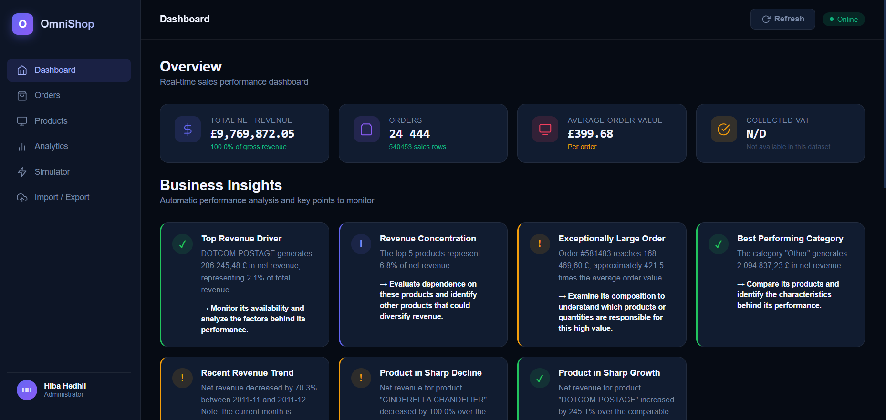
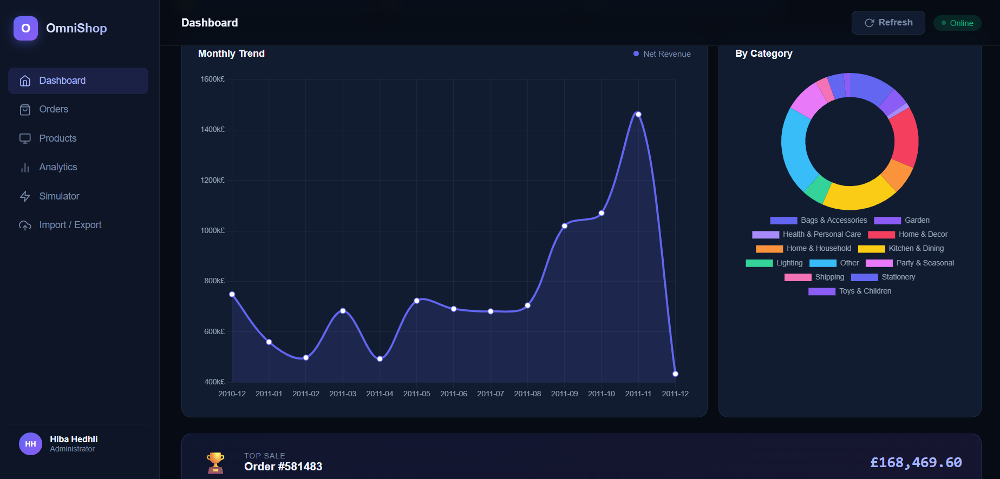
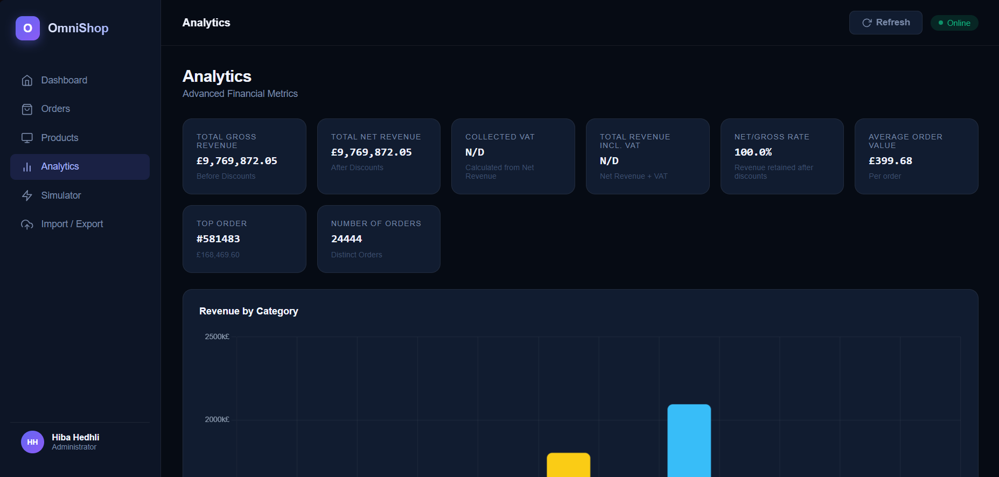
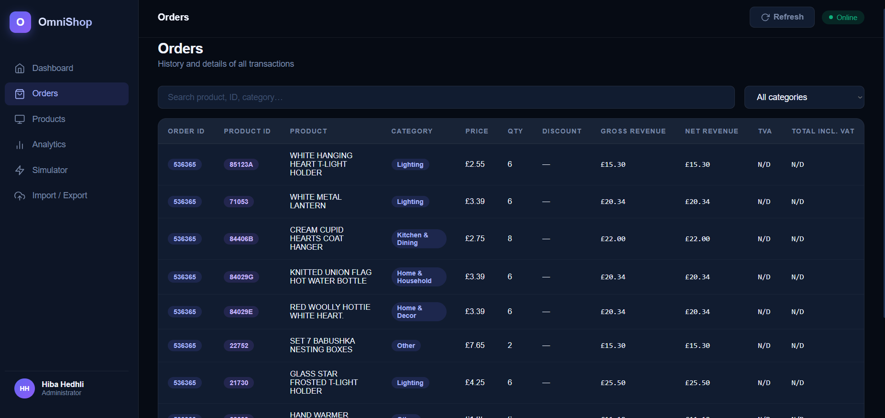
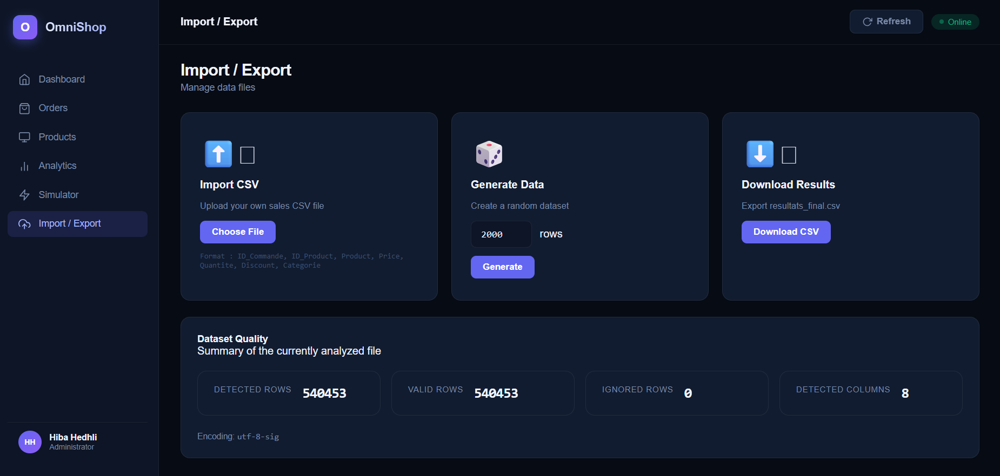
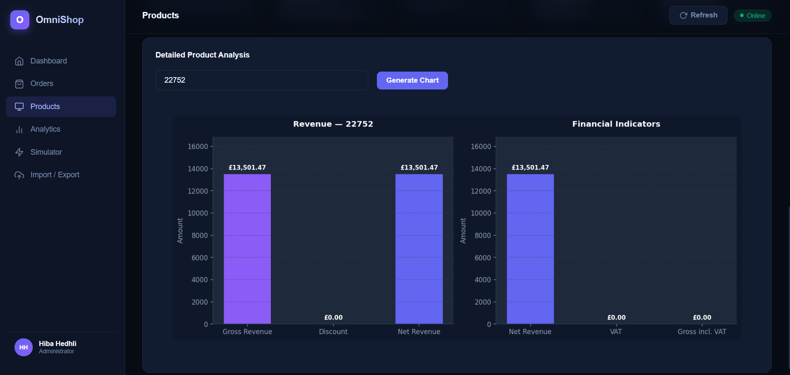
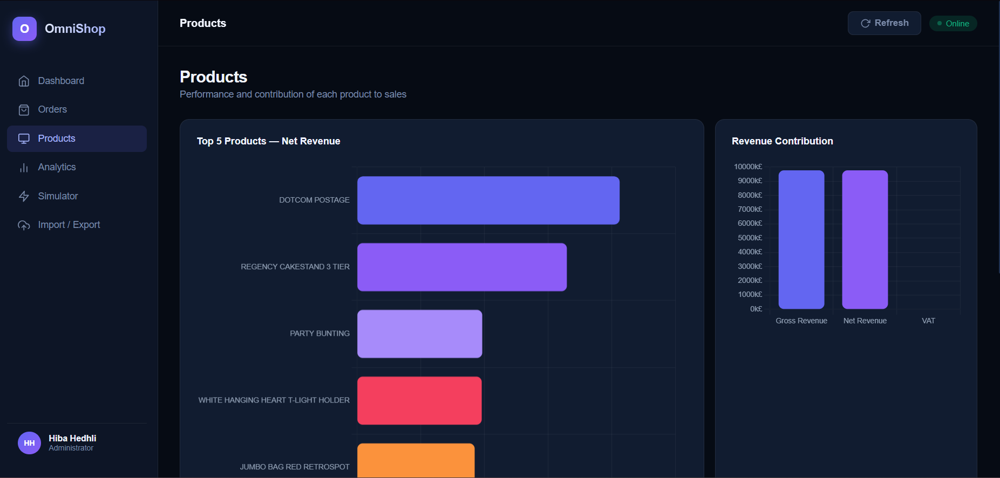
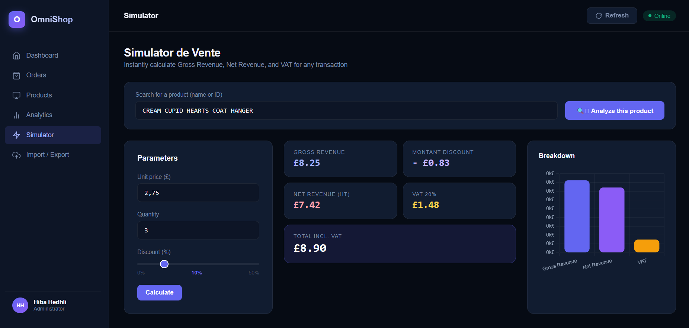

# Dashboard OmniShop

An end-to-end **sales analytics and business intelligence dashboard** that transforms transactional e-commerce data into revenue metrics, product and category analysis, automated business insights, interactive visualizations, and sales simulations.

> **What the project is:** a Flask-based analytics application that processes transactional sales data, standardizes it, computes business KPIs, detects meaningful sales patterns, and exposes the results through an interactive web dashboard.

> **What it is not:** it is not a universal BI platform that automatically understands every possible dataset. The input data must contain the fields required by the configured data adapter. Dataset-specific differences such as column names, currency and date representation are handled by the data-processing layer.

> **Data note:** the current example dataset follows a UK online-retail transactional structure. Monetary values are therefore displayed in **GBP**. The application uses dynamic currency configuration rather than hard-coding one currency throughout the dashboard.

```text
Raw transactional data
        ->
Data adapter / normalization
        ->
Validation & cleaning
        ->
Sales metrics
        ->
Product / category analysis
        ->
Business insights
        ->
Flask API
        ->
Interactive dashboard
        ->
Simulation & decision support
```

---

# 1. Project Overview

E-commerce businesses generate large volumes of transactional data, but raw sales records alone do not provide an immediate understanding of business performance.

Dashboard OmniShop transforms those transactions into a centralized analytics interface where users can answer questions such as:

- How much revenue was generated?
- Which products generate the most revenue?
- Which categories perform best?
- Which products are growing or declining?
- Are revenues concentrated in a small number of products?
- What are the largest orders?
- What is the recent revenue trend?
- What would happen if price, quantity or discount changed?

The project combines **data processing, business analytics, visualization and interactive web development** in one application.

---

# 2. Main Features

| Feature | Description |
|---|---|
| **Sales KPIs** | Revenue, orders, products, quantities and other business indicators |
| **Product analysis** | Search and analyze individual products |
| **Category analysis** | Compare performance between product categories |
| **Revenue analysis** | Analyze total and recent revenue trends |
| **Business insights** | Automatically identify important sales patterns |
| **Transaction search** | Search orders, products, categories and dates |
| **Sales simulator** | Test price, quantity and discount scenarios |
| **Dynamic currency** | Display monetary values according to the dataset configuration |
| **Interactive dashboard** | Web interface connected to Flask APIs |
| **Charts** | Visualize sales and product performance |
| **REST-style API endpoints** | Separate frontend and backend analytics operations |

---

# 3. Dashboard

The dashboard provides a centralized view of sales performance.

It combines:

- KPI cards
- Revenue visualizations
- Product rankings
- Category analysis
- Transaction search
- Automated insights
- Product analysis
- Sales simulation

The frontend communicates with Flask API endpoints rather than embedding the analytics logic directly into the interface.

---

## Dashboard Preview

The dashboard provides an interactive view of sales performance, orders, product analysis, business insights, data management, and revenue simulation.

### Dashboard Overview





### Sales Analytics



### Orders



### Import & Export



### Product Analysis





### Sales Simulator



## Dashboard Architecture

```text
Browser
   │
   ├── Dashboard UI
   ├── Product search
   ├── Simulator
   └── Charts
          │
          ▼
      Flask API
          │
          ├── /api/orders
          ├── /api/chart_product
          ├── /api/simulate
          └── Analytics endpoints
                  │
                  ▼
          Data / Analytics Layer
                  │
                  ▼
             ventes.csv
```

---

# 4. Data Architecture

The application separates data processing from presentation.

| Layer | Main responsibility |
|---|---|
| **Raw data** | Transactional sales records |
| **Data adapter** | Normalize the input structure |
| **Analytics** | Calculate business metrics and trends |
| **Charts** | Generate analytical visualizations |
| **Flask API** | Expose processed information to the frontend |
| **Dashboard** | Present results interactively |
| **Simulator** | Calculate hypothetical sales scenarios |

The current transactional schema contains:

```text
ID_Commande
ID_Produit
Produit
Prix
Quantite
Remise
Categorie
Date
```

Each row represents a sales transaction/order line.

---

# 5. Data Processing

The application processes transactional data before calculating business indicators.

The processing layer handles:

- Data loading
- Column normalization
- Numeric conversion
- Date parsing
- Revenue calculations
- Aggregation
- Product-level aggregation
- Category-level aggregation
- Order-level aggregation
- Currency configuration

Revenue-related calculations are derived from the transaction information rather than manually entered dashboard values.

---

# 6. Business Analytics

The analytics engine calculates several categories of indicators.

### Revenue

The application calculates:

- Gross revenue
- Discounts
- Net revenue
- Tax
- Total revenue including tax

### Orders

The dashboard analyzes:

- Number of orders
- Order values
- Largest orders
- Average order-related metrics

### Products

Product-level analytics include:

- Product revenue
- Product sales volume
- Product ranking
- Product revenue trends
- Product growth
- Product decline

### Categories

Category-level analytics allow the user to identify the strongest-performing parts of the catalog.

---

# 7. Automated Business Insights

One of the main features of the project is the automated generation of business insights.

Instead of requiring the user to manually interpret every chart, the analytics layer identifies notable patterns.

The current insight engine can detect:

### Top Revenue Driver

Identifies the product contributing the largest amount of revenue.

### Revenue Concentration

Shows how strongly revenue is concentrated among the highest-performing products.

### Exceptionally Large Order

Identifies unusually large orders in the transaction data.

### Best Performing Category

Determines which category contributes the most revenue.

### Recent Revenue Trend

Evaluates the recent evolution of revenue.

### Product in Sharp Decline

Identifies products whose revenue has decreased significantly between comparable periods.

### Product in Sharp Growth

Identifies products experiencing significant revenue growth.

---

# 8. Time-Based Product Analysis

Product growth and decline are not calculated by simply comparing the entire dataset.

The application compares **equivalent periods**.

For an incomplete current month:

```text
Previous comparable period
          ↓
Current period
          ↓
Revenue comparison
          ↓
Percentage variation
          ↓
Growth / decline classification
```

This avoids comparing a partial current month with an entire previous month, which could produce misleading conclusions.

The current business rules identify:

```text
Sharp decline: variation ≤ -20%
Sharp growth:  variation ≥ +20%
```

Products with insufficient previous-period revenue are excluded from the comparison to reduce noise.

---

# 9. Product Analysis

Users can search for a product using its:

- Product name
- Product ID

The backend then retrieves the corresponding transactions and generates a product-specific revenue chart.

The search supports both human-readable product names and product identifiers.

For example:

```text
Product ID:
85123A

Product:
WHITE HANGING HEART T-LIGHT HOLDER
```

The generated analysis can include:

- Revenue evolution
- Product revenue
- Tax
- Total revenue including tax
- Transaction-level aggregation

---

# 10. Sales Simulator

The dashboard includes an interactive sales simulator for testing hypothetical transactions.

Users can specify:

```text
Unit price
Quantity
Discount %
```

The simulator then calculates:

```text
Gross Revenue
       ↓
Discount Amount
       ↓
Net Revenue (before VAT)
       ↓
VAT
       ↓
Total Revenue
```

### Example

```text
Unit price:  £99.99
Quantity:    3
Discount:    10%

Gross revenue:      £299.97
Discount:           £30.00
Net revenue (HT):   £269.97
VAT:                £53.99
Total revenue:      £323.96
```

The calculations are also exposed through the backend API.

Example API request:

```http
POST /api/simulate
```

Example input:

```json
{
  "prix": 10,
  "quantite": 2,
  "remise": 10
}
```

Example response:

```json
{
  "ca_brut": 20.0,
  "ca_net": 18.0,
  "ca_ttc": 21.6,
  "remise_montant": 2.0,
  "tva": 3.6
}
```

---

# 11. Dynamic Currency Handling

The dashboard does not assume that every dataset uses Tunisian dinars or British pounds.

Currency information is stored in the application configuration and propagated through the analytics and visualization layers.

For example:

```text
GBP → £
EUR → €
USD → $
TND → DT
```

This prevents currency-specific values from being hard-coded into charts and dashboard calculations.

For the current dataset:

```text
Currency: GBP
Symbol: £
Locale: en-GB
```

---

# 12. API

The Flask backend exposes dedicated endpoints for the dashboard.

Important endpoints include:

| Endpoint | Purpose |
|---|---|
| `/api/orders` | Search and retrieve transaction data |
| `/api/chart_product` | Generate a product-specific revenue chart |
| `/api/simulate` | Calculate a hypothetical sales scenario |

The API allows the frontend to remain relatively independent from the underlying Python analytics implementation.

---

# 13. Example Business Results

The current dataset produces the following overall figures:

| Metric | Result |
|---|---:|
| Total revenue | **£9,769,872.05** |
| Sales rows | **540,453** |
| Orders | **24,444** |
| Products | **3,958** |

### Top revenue-generating products

| Product | Revenue |
|---|---:|
| DOTCOM POSTAGE | £206,245.48 |
| REGENCY CAKESTAND 3 TIER | £164,762.19 |
| PARTY BUNTING | £98,302.98 |
| WHITE HANGING HEART T-LIGHT HOLDER | £97,894.50 |
| JUMBO BAG RED RETROSPOT | £92,356.03 |

> These figures describe the dataset included with the project. They should not be interpreted as current real-world company performance.

---

# 14. Technology Stack

## Backend

- Python
- Flask
- Pandas
- NumPy

## Data Analysis

- Pandas
- CSV
- Custom analytics pipeline
- Aggregation and statistical calculations

## Visualization

- Matplotlib
- JavaScript charts

## Frontend

- HTML5
- CSS3
- JavaScript

## Development

- Python virtual environment
- Git
- GitHub
- VS Code

---

# 15. Project Structure

```text
dashboard_omnishop/
│
├── app.py
│
├── data/
│   └── ventes.csv
│
├── scripts/
│   ├── analytics.py
│   ├── charts.py
│   └── data_adapter.py
│
├── static/
│   ├── css/
│   ├── js/
│   │   └── dashboard.js
│   └── images/
│
├── templates/
│   └── index.html
│
├── requirements.txt
│
└── README.md
```

---

# 16. Installation

Clone the repository:

```bash
git clone https://github.com/hibahedhli/dashboard_omnishop.git
cd dashboard_omnishop
```

Create a virtual environment:

```bash
python -m venv .venv
```

Activate it on Windows:

```powershell
.venv\Scripts\Activate.ps1
```

Install dependencies:

```bash
pip install -r requirements.txt
```

---

# 17. Run the Application

Start Flask:

```bash
python app.py
```

The dashboard will be available at:

```text
http://127.0.0.1:5000
```

Open the address in your browser.

---

# 18. Example Workflow

A typical analysis follows this workflow:

```text
1. Load transactional data
          ↓
2. Normalize and validate data
          ↓
3. Calculate revenue and sales metrics
          ↓
4. Aggregate products and categories
          ↓
5. Detect important business patterns
          ↓
6. Expose results through Flask APIs
          ↓
7. Display results in the dashboard
          ↓
8. Investigate individual products
          ↓
9. Simulate alternative sales scenarios
```

---

# 19. Limitations

The project has several important limitations.

### Dataset dependency

The analytics require a transactional dataset containing the fields necessary for the calculations.

Datasets with substantially different structures may require a new adapter or configuration.

### Revenue interpretation

Revenue calculations depend on the meaning and quality of the source fields.

Incorrect prices, quantities, discounts or taxes in the source data will affect the resulting analysis.

### Currency

Currency detection/configuration does not automatically convert between currencies.

If a dataset contains multiple currencies, an explicit currency-handling strategy is required.

### Product growth

Growth and decline indicators depend on the available historical period and the chosen comparison window.

A product with very low historical sales can produce unstable percentage variations.

### Automated insights

Business insights are rule-based analytical signals.

They should be investigated by a human before being used for major business decisions.

### Dataset quality

Missing dates, invalid quantities, duplicate transactions or inconsistent product identifiers can affect the analysis.

---

# 20. Future Improvements

Potential improvements include:

- [ ] Customer-level analytics
- [ ] Customer segmentation
- [ ] Customer lifetime value
- [ ] Customer churn prediction
- [ ] Sales forecasting
- [ ] Demand forecasting
- [ ] Anomaly detection with machine learning
- [ ] Advanced product recommendations
- [ ] Interactive date-range filtering
- [ ] Database integration
- [ ] Authentication and user management
- [ ] PDF / Excel report export
- [ ] Cloud deployment
- [ ] Automated scheduled reports
- [ ] Advanced machine-learning insights

---

# 21. Project Goals

This project was developed to demonstrate practical skills in:

- Data analysis
- Business intelligence
- Data visualization
- Python
- Flask
- REST API development
- Frontend/backend integration
- Data processing
- Statistical analysis
- Git and GitHub
- Building decision-support tools from raw transactional data

The project focuses on moving beyond simple dashboards by adding an **analytical layer capable of automatically identifying business-relevant patterns**.

---

# Author

**Hiba Hedhli**

LMI Student — Mathematics & Computer Science

Interested in:

- Data Science
- Artificial Intelligence
- Cybersecurity
- Software Engineering
- Business Intelligence

---

## License

This project is available for educational and portfolio purposes.
